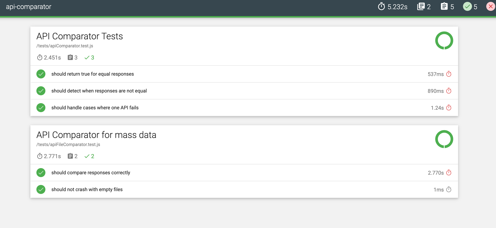

# api-comparator
This repository contains automated tests for comparing the endpoints API using Mocha and Chai.

## Pre-Requisites
Node.js v14.0.0 or newer

## Table of Contents
1. [Getting Started](#getting-started)
2. [Folder Structure](#folder-structure)
3. [Setup](#setup)
4. [Running Tests](#running-tests)
5. [Adding New Tests](#adding-new-tests)

### Getting Started
To get started with the project, clone the repository to your local machine.

```
git clone git@github.com:fathirwafda/api-comparator.git
cd api-comparator
```

### Folder Structure
The project has the following folder structure:

```
project-root
│
|
├── src
|   ├── fileComparator.js          # Collections of logic/control for our tests/scenarios
|
├── tests                          # Test directory
│   ├── apiComparator.test.js      # Tests for simple comparator
│   └── apiFileComparator.test.js  # Tests for comparator by using files
│   
├── node_modules                   # Node.js modules
├── package.json                   # Node.js package manifest file
└── README.md                      # This file
└── reports                        # Generated report when the test is done
    └── mochawesome
        └── assets
        └── mochawesome.html       # Report file in html format
        └── mochawesome.json       # Report file in json
```

### Setup
1. Install Node.js: If not already installed, download and install Node.js from [Node.js Official Website](https://nodejs.org/).

2. Edit the package.json as the following configuaration Or make your own if you are familiar with it

    ```
    {
      "name": "apitest-automation-mocha",
      "version": "1.0.0",
      "description": "",
      "main": "index.js",
      "scripts": {
        "test": "mocha 'test/**/*.test.js' --recursive --reporter mochawesome --reporter-options reportDir=reports/mochawesome/ --timeout 180000",
        "reports": "open 'reports/mochawesome/mochawesome.html'"
      },
      "keywords": [],
      "author": "Fathir Wafda",
      "license": "MIT",
      "devDependencies": {
        "chai": "^4.3.8",
        "chai-http": "^4.4.0",
        "mocha": "^10.2.0",
        "dotenv": "^7.0.0",
        "mochawesome": "^3.0.2"
      }
    }
    ```

3. Install Dependencies: Navigate to the project root directory in the terminal and run the following command to install the necessary dependencies:

```
npm install
```

### Running Tests
Navigate to the project root directory in the terminal and run the following command to execute the tests:

```
npm run test
```

Sample Report


### Adding New Tests
1. Create Test File: Create a new .test.js file under the relevant directory inside the test/api folder.
2. Write Test: Use Mocha and Chai to write your test cases in the newly created .test.js file.
3. Run Test: Use the npm test command to run your tests and validate that they are working as expected.